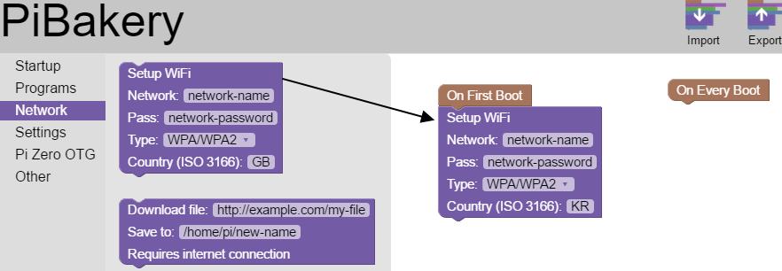
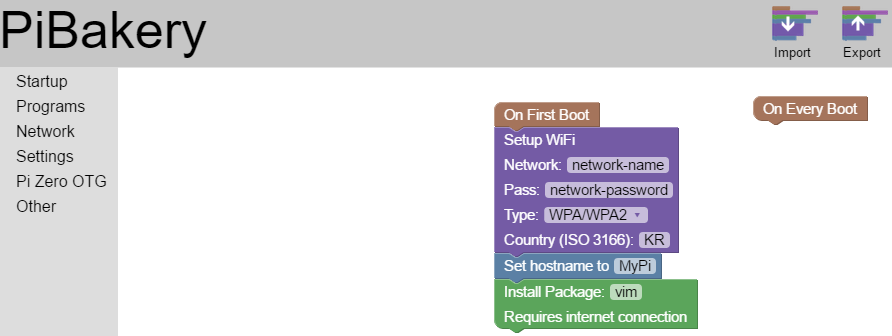

# 헤더리스 이미지 만들기
처음 라즈비안 이미지를 만든 다음 초기 세팅을 헤드리스로 진행하려면 몇가지 문제가 있다. 
먼저 SSH 서비스가 2016년 11월부터는 다운로드 이미지에서 막혀있다.(하지만 뒤에서 설명할 PiBakery를 이용해 설치하는 이미지에는 SSH가 활성화 되어 있다.) 그리고 네트워크는 유선랜에서만 dhcp모드로 작동한다. 파이3부터는 WiFi가 지원되기 때문에 WiFi세팅만 가능하다면 랜케이블 연결없이 네트워크 접속이 가능하다. 
파이 부팅 없이 SD 카드의 라즈비안 이미지를 수정해 SSH 서비스 활성화, WiFi 설정을 해보겠다. 이 작업이 성공하면 파이를 헤드리스 모드로 부팅한 다음 PC에서 SSH로 바로 접속이 가능하다. 

두가지 방법이 가능하다. 우선 PC에서 PiBakery 프로그램을 이용해 라즈비안 이미지를 세팅하는 것이고 다음은 리눅스 운영체제에서 이미지 파일을 내용을 직접 수정하는 방법이다. 첫번째 방법이 쉬울 뿐 아니라 강력한 기능을 제공하기 때문에 PiBakery를 사용할 것을 추천한다. 특히 설정을 바꾸면서 수시로 이미지를 만들어야 한다면 아주 좋은 선택이 될 수 있다. 아마도 많은 분들은 라즈비안 이미지를 부팅한 다음 설정을 끝내고 이 이미지를 백업한 다음, 새로운 이미지를 만드는 시점에 백업 이미지를 복사해서 부팅, 바뀐 설정값을 수정하는 방법을 사용하고 계실 것이다. 하지만 이 방법의 단점은 이미지를 복사할 SD카드가 동일 모델이거나 큰 사이즈의 용량인 경우에만 가능하다. 그리고 새로운 라즈비안 이미지에 적용할 경우 처음부터 작업을 다시 해야만 하는 단점도 있다. 
하지만 PiBakery의 단점 역시 존재한다. PiBakery는 프로그램이 라즈비안 이미지를 내부에 SSH를 지원하는 저장하고 있기 때문에 최신 버젼의 라즈비안을 사용하지 못한다는 단점이 있으며 네트워크 설정 역시 DHCP를 이용한 WiFi만 지원하는 단점도 있다. 그렇다고 아주 구식 버젼이 설치되는 것은 아니기 때문에 대부분의 경우 문제가 되지 않는다. 현재(2019.02월) Rasbian 9.3(stretch)가 설치된다.

## PiBakery툴 이용하기
이 프로그램은 현재(2019.02) 네트워크 설정에서 무선랜만 지원하기 때문에  무선랜을 기본으로 지원하는 파이 3 이상에서 사용할 것을 추천한다.  
[PiBakery 홈페이지](https://www.pibakery.org/)에서 Windows, Mac 버젼 중 알맞은 프로그램을 다운로드한다.
특별한 이유가 없으면 설치 도중 Select Components에서 설치할 컴포넌트는 "Rasbian Full and Rasibian Lite"를 선택한다.
이 프로그램의 특징은 라즈비안 설치 이후 필요한 각종 설정 작업을 이미지를 만드는 과정에서 할 수 있게 해준다는 것이다. 즉 WiFi 암호 설정, IP 주소 설정 등의 작업을 이미지를 만들면서 한번에 할 수 있다. 
이 프로그램은 스크래치(scratch)기반이며 사용 방법은 원하는 컴포넌트를 drag & drop 방식을 이용해 화면 좌측의 팔레트에서 중앙의 캔버스로 끌고 오면 된다. 사용 방법이 무척 간단하며 쉽다.
간단하게 Lite 버젼의 라즈비안 이미지를 만드는 실습을 해보겠다.  

#### PiBakery Startup 컴포넌트 가져오기
PiBakery의 좌측 팔레트의 Startup에서 On First Boot, On Every Boot 컴포넌트를 가져온다. 이름에서 알 수 있듯이 On First Boot는 첫번째 부팅에만 적용되는 설정값이다. 대부분 필요한 설정 작업은 이 컴포넌트에 연결한다. On Every Boot는 부팅시 매번 실행할 컴포넌트를 연결해 나간다. 보통 시작 프로그램을 여기에 연결하면 된다.

  

#### 네트워크 컴포넌트 가져오기
Network에서 Setup WiFi 컴포넌트를 가져온 다음 On First Boot 아래에 연결한다. 그리고 SSID(Network), 암호(Pass), Type(WiFi 방식),Country 값을 본인의 환경에 맞게 수정한다.

  

#### 기타 필요한 컴포넌트 가져오기
나머지 필요한 설정 작업을 팔레트를 이용해서 진행할 수 있다. 그림에서는 vim을 설치하는 컴포넌트를 추가했다.

  

#### 이미지 굽기
프로그램 우측 상단의 Write 이미지를 클릭하면 이미지, 이미지 기록용 SD카드 경로 설정이 나온다. 확인 후 Start Write 버튼을 누르면 이미지가 만들어 진다. 따로 이미지를 만들기 위해 Win32diskImager, Etcher 등을 사용할 필요가 없다.

  

#### 설정값 저장 및 가져오기
앞에서 설정한 내용을 저장 후 다음 작업에서 재사용하려면 우측 상단의 Export, Import 기능을 이용하면 된다.   

## 리눅스에서 작업하기
 SD카드 이미지는 두개의 파티션으로 이루어져 있다. 만약 Win32DiskImager를 사용해서 SD카드를 만들었다면 첫번째 BOOT 파티션은 FAT32이다. 그리고 두번째 파티션은 ext4 포맷이다. 이 두번째 파티션에 실제 라즈비안이 운영체제가 들어있다. ext4는 리눅스 시스템에서 사용하는 파일 시스템으로 PC에서는 지원하지 않기 때문에 보이지 않는다. 따라서 ext4 파일 시스템을 들여다 보려면 리눅스 시스템이 필요하다. 만약 PC 사용자라면 가상 머신을 이용하면 된다. 오라클 VirtualBox, 델의 VMware player 등의 무료 프로그램을 사용해 리눅스 OS를 설치하거나 이미지를 구해서 작업을 진행한다. 또다른 파이를 이용하는 것도 좋은 방법이다. 이하 모든 작업은 root권한으로 작업한다.  

#### MicroSD 카드 확인
아래 그림과 같은 USB 아답터에 라즈비안 이미지가 들어있는 Micro SD 카드를 넣은 후 리눅스 시스템이 작동중인 PC USB포트에 삽입한다.

만약 가상 머신을 사용한다면 리눅스 가상 머신에게 USB 디바이스의 소유권을 넘겨준다. 만약 리눅스 시스템에서 정상적으로 USB를 인식한다면 다음과 같이 확인 가능하다.

fdisk 명령으로 /dev/디렉토리에 sdb1,sdb2가 있으며 앞에서 설명한 것처럼 SD카드가 2개의 파티션으로 구성된 것을 보여주는 것이다.  

#### MicroSD 카드 마운트
/dev/sdb1, /dev/sdb2와 같은 저장 장치를 이용하려면 마운트를 해야 한다. 다음과 같이 마운트를 한다. 먼저 /mnt 디렉토리에 sdb1.sdb2 디렉토리를 만든다. 
* #mkdir /mnt/sdb1 
* #mkdir /mnt/sdb2 
* #mount /dev/sdb1 /mnt/sdb1 
* #mount /dev/sdb2 /mnt/sdb2  

이제 /mnt/sdb1, /mnt/sdb2 디렉토리로 이동해서 작업이 가능하다. 다음과 같이 PC에서 보이지 않던 파일 정보들이 보인다.
 

#### SSH 활성화
SSH 서비스 활성화는 /mnt/sdb1 (BOOT 파티션)에 ssh 이름의 빈 파일(사이즈 0)를 만들어 주면 된다.  
* #touch /mnt/sdb1/ssh  

#### WiFi 셋업
WiFi 셋업은 공유기 정보와 접속 암호를 알고 있다는 가정하에 진행한다. ssid가 _YourSSID_ , 공유기 암호가 _passwd_ 라고 가정하자.  

wpa_supplicant 파일을 수정한다.
* #vi /mnt/sdb2/etc/wpa_supplicant/wpa_supplicant.conf

다음과 같이 공유기 정보를 추가한다. 
_ctrl_interface=DIR=/var/run/wpa_supplicant GROUP=netdev
update_config=1  
network={ 
    ssid="YourSSID" 
    psk="passwd" 
}_

그리고 다음은 dhcpcd.conf 파일을 수정한다. 
* #vi /mnt/sdb2/etc/dhcpcd.conf

dhcpd.conf 파일 수정 내용은 본문을 참조한다. 

#### 마무리
마운트를 해제하고 SD카드를 제거 한 다음 파이에 넣어서 작동시키면 된다.
* #umount /dev/sdb1  
* #umount /dev/sdb2   
